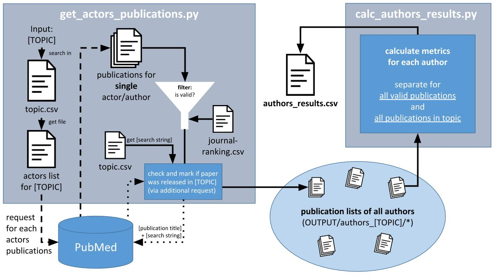

PubMed Author Evaluation
========================

Eine Sammlung von Python-Scripts, die mit Hilfe von [PubMed](https://europepmc.org/) biomedizinische Publikationen durchsucht und Informationen über Autoren extrahiert und aufbereitet.

## Hintergrund

Ziel des Projektes ist es individuelle Akteure in öffentlichen, wissenschaftsnahen oder wissenschaftsassoziierten Diskursen bezogen auf ihre Stellung im Wissenschaftssystem näher zu charakterisieren, insbesondere zu ermitteln:

1. ob ein Akteur als ***contributing expert*** eines bestimmten **Themenfeldes** gelten kann und dort publiziert hat
2. ob ein Akteur als ***contributing expert*** ausgewiesen ist, allerdings **nicht** in dem jeweils interessierenden **Themenfeld** publiziert hat

## Installation und Ausführung

Siehe: [Python Installation und Ausführung](docs/python/Installation_und_Ausfuehrung.md)

## Ablauf

#### 1. Manuell: Anpassung der Eingabedateien
- Hinzufügen der Themen (`topic.csv`)
- Hinzufügen der Akteure in CSV-Liste

#### 2. Automatisch via get_actors_publications.py
- Sammelt alle Publikationen jedes Akteurs (via PubMed)
- Filtert Publikationen (via `journal_ranking.csv`)
- Erstellt Autordatei für jeden Akteur
	- eine Zeile = eine Publikation

#### 3. Manuell: Überprüfung der Ausgabe
- Erstellte Autordateien überprüfen
	- insbesondere `Active` und `Authorship Confidence` Werte
- Ggf. Eingabedateien anpassen
	- Suchstring für Thema/Akteure anpassen
	- Falls automatische Autorschaftsbewertung: `Location` und `Institution` Liste verbessern
	- Bei Änderungen: erneute Ausführung von `get_actors_publications.py`

#### 4. Automatisch via calc_authors_results.py
- Nutzt alle Autordateien
- Erstellt Gesamtliste mit allen Autoren und deren Metriken
	- eine Zeile = ein Autor

Beide Scripts fragen beim Aufruf direkt nach einem Thema (siehe topics.csv) und ob die Publikationen via Name oder [ORCID](https://orcid.org/) der Autoren abgerufen werden soll.

## Ein- und Ausgaben

### *INPUT*-Ordner

Der *INPUT*-Ordner enthält alle Akteurlisten und das Journal Ranking.
Zudem ist die Datei `topics.csv` sehr wichtig, sie ist sozusagen die Konfigurationsdatei der Scripts.

#### topics.csv

Dateiformat: csv  
Oberste Zeile: Spaltenbezeichnung  
Darauffolgende Zeilen: **eine Zeile = ein Thema**

- `short` – Abkürzung für das Thema, benötigt beim Script-Start.

- `search string` – der Suchstring ist das Mittel um zu überprüfen, ob eine Publikation in einem bestimmten Themenbereich veröffentlicht wurde.
Hierzu wird eine Suche bei PubMed gestartet, die die Publikations-ID und den Suchstring enthält. (Siehe Code für Details)

- `actors list file` – Dateiname der Akteurlisten zum jeweiligen Thema

#### Akteurlisten

Dateiformat: csv  
Oberste Zeile: Spaltenbezeichnung  
Darauffolgende Zeilen: **eine Zeile = ein Akteur**

- `AktID` – eindeutige ID für den Autor
- `Name` – Klarname der Person
- `Position` (optional)
- `Institution` (optional)
- `Label` (optional, z.B. Arzt, Experte)
- `InstitutionList` – eine Liste der Institutionen an denen der Akteur publiziert hat (für Autorschaftsbewertung)
- `LocationList` – ein Liste der bekannten Städte/Länder in denen der Akteur publiziert hat (für Autorschaftsbewertung)
- `PubMedSearch` – der Suchstring um die Person bei PubMed zu identifizieren. Einfacher String oder [komplexer Query](https://europepmc.org/Help#mostofsearch).

#### journal-ranking.csv
Export von [Scimago Journal & Country Rank](http://www.scimagojr.com/journalrank.php)

### *OUTPUT*-Ordner

- `author_[topic]/` Unterordner – Enthält alle Autordateien zu einem Thema.

- `result_[topic].csv` – Enthält die entgültigen Geasmtauswertung für alle Autoren eines Themas.

#### Autordateien

Dateiformat: csv  
Oberste Zeile: Spaltenbezeichnung  
Darauffolgende Zeilen: **eine Zeile = ein Publikation**

- `Active` – 0 oder 1. Entscheidet ob Publikation in die Gesamtauswertung des Themas miteinbezogen wird.
- `Authorship Confidence` – Resultat der automatischen Autorschaftsbewertung (siehe unten)
- `ID (LINK)` – ID der Publikation in der PubMed Datenbank. Verlinkt, kann mit Strg+Klick geöffnet werden.
- `Topic` – Abkürzung des Themas: falls die Publikation dem Thema (über den Themen-Suchstring) zugeordnet wurden konnte.
- `Title` – Titel der Publikation
- `Citations` – Anzahl der Zitierungen durch andere Publikationen
- `Date` – Datum der Veröffentlichung
- `Author Position` – first/middle/last
- `Co-Author count` – Anzahl der Co-Autoren

## Automatische Autorschaftsbewertung

Da die Daten in der PubMed Datenbank sehr inkonsistent sind kann sich der Algorithmus nicht immer sicher sein ob die betrachtete Person (der Akteur) tatsächlich Autor der gefundene Publikation ist oder es z. B. eine Person mit ähnlichem Kürzel ist.

Aus diesem Grund ermöglicht der `get_actors_publications.py` Script eine automatische Bewertung bzgl. der Autorschaft. Diese kann beim Aufruf an oder ausgeschaltet werden.

Es gibt einige Indizien die das Vertrauen in die Autorschaft erhöhen. Falls eines zutrifft wird der Zahlenwert auf den `Authorship Confidence`-Wert addiert.

- `+0.4` – Vorname stimmt überein
- `+0.3` – eine Institution stimmt überein
- `+0.2` – eine Location stimmt überein

Die Daten *Institution* und *Location* werden über die Autorenliste gespeist. Umso mehr Daten sich dort befinden um so aussagekräftiger ist der `Authorship Confidence`-Wert.

Der `Authorship Confidence`-Wert hat auch einen direkten Einfluss auf den `Active`-Wert. Ist `Authorship Confidence` = 0, so wird `Active` auf 0 gesetzt.
Hier sollte dann **unbedingt noch einmal überprüft werden** ob nicht doch eine Autorschaft besteht.
Ist die betrachtete Person tatsächlich Autor der Publikation, so sollten *Institution* und *Location* zur Akteurliste hinzugefügt werden.
So wird beim nächsten Durchlauf des Scripts ein besserer `Authorship Confidence`-Wert gewährleistet.

## Lizenz
- **Conception:** Prof. Dr. Markus Lehmkuhl (KIT & FU Berlin), Dr. Evgeniya Boklage (FU Berlin)
- **Implementation:** Yannick Milhahn (TU Berlin & FU Berlin)

Distributed under GPLv3 License.
See [LICENSE](LICENSE) for more information.
