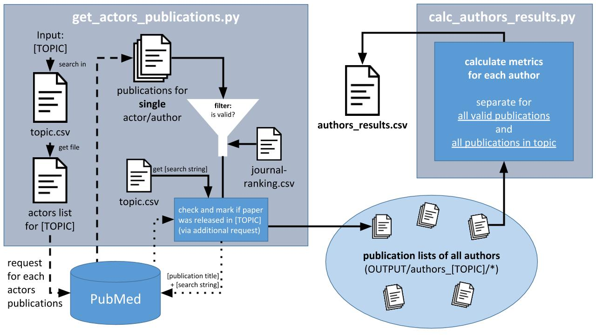

PubMed Author Evaluation
========================

Dies ist eine Sammlung von Python-Scripts, die mit Mithilfe von [PubMed](https://europepmc.org/) biomedizinische Publikationen durchsucht und Informationen über Autoren extrahiert und aufbereitet.

## Hintergrund

Ziel des Projektes ist es individuelle Akteure in öffentlichen, wissenschaftsnahen oder wissenschaftsassoziierten Diskursen bezogen auf ihre Stellung im Wissenschaftssystem näher zu charakterisieren, insbesondere zu ermitteln:

1. ob ein Akteur als ***contributing expert*** eines bestimmten **Themenfeldes** gelten kann und dort publiziert hat
2. ob ein Akteur als ***contributing expert*** ausgewiesen ist, allerdings **nicht** in dem jeweils interessierenden **Themenfeld** publiziert hat

## Installation und Ausführung

Siehe: [Python Installation und Ausführung](docs/python/Installation_und_Ausfuehrung.md)

## Ablauf

#### Anpassung der Eingabedateien
- Hinzufügen eines Themas (topic.csv)
- Hinzufügen der Akteure in CSV-Liste

#### Ausführung: get_actors_publications.py
- Sammelt alle Publikationen jedes Akteurs (via PubMed)
- Filtert Publikationen (via journal_ranking.csv)
- Erstellt Autordatei für jeden Akteur
	- eine Zeile = eine Publikation

#### Überprüfung der Ausgabe
- Erstellte Autordateien überprüfen
	- insbesondere `Active` und `Authorship Confidence` Werte
- Ggf. Eingabedateien anpassen
	- Suchstring für Thema/Akteure anpassen
	- Falls automatische Autorschaftsbewertung
		- `Location` und `Institution` Liste verbessern
	- Erneute Ausführung von `get_actors_publications.py`

#### Ausführung: calc_authors_results.py
- Nutzt alle Autordateien
- Erstellt Gesamtliste mit allen Autoren und deren Metriken
	- eine Zeile = ein Autor

Beide Scripts fragen beim Aufruf direkt nach einem Thema (siehe topics.csv) und ob die Publikationen via Name oder [ORCID](https://orcid.org/) der Autoren abgerufen werden soll.

## Ein- und Ausgaben

### *INPUT*-Ordner

Der *INPUT*-Ordner enthält alle Akteurlisten und das Journal Ranking.
Zudem ist die Datei "topics.csv" sehr wichtig, sie ist sozusagen die Konfigurationsdatei der Scripts.

#### topics.csv

Die oberste Spalte gibt die Feldbezeichnung an.
Jede darauffolgende Zeile ist einem Thema zugeordnet.

- `short` - Abkürzung für das Thema, dient zum Aufruf der Scripts.

- `search string` - Der Suchstring ist das Mittel um zu überprüfen, ob eine Publikation in einem bestimmten Themenbereich veröffentlicht wurde.
Hierzu wird eine Suche bei PubMed gestartet, die die Publikations-ID und den Suchstring enthält. (Siehe Code für Details)

- `actors list file` - Dateiname der Akteurlisten zum jeweiligen Thema

#### Akteurlisten

Die Akteurlisten sind CSV-Dateien mit

- `AktID` - eindeutige ID für den Autor
- `Name` - Klarname der Person
- `Position` (optional)
- `Institution` (optional)
- `Label` (optional, z.B. Arzt, Experte)

Daten für die Suche:

- `InstitutionList` - Eine Liste der Institutionen an denen der Akteur publiziert hat
- `LocationList` - Ein Liste der bekannten Städte/Länder in denen der Akteur publiziert hat
- `PubMedSearch` - der Suchstring um die Person bei PubMed zu identifizieren. Einfacher String oder [komplexer Query](https://europepmc.org/Help#mostofsearch).

#### journal-ranking.csv
Export von [Scimago Journal & Country Rank](http://www.scimagojr.com/journalrank.php)

### *OUTPUT*-Ordner

- author_[topic] Unterordner: Enthält alle Autordateien zu einem Thema.

- result_[topic].csv: Enthält die entgültigen Geasmtauswertung für alle Autoren eines Themas.

#### Autordateien

Die oberste Spalte gibt die Feldbezeichnung an.
Jede darauf folgende Zeile ist einer Publikation zugeordnet.

- `Active` - 0 oder 1. Entscheidet ob Publikation in die Gesamtauswertung des Themas miteinbezogen wird.
- `Authorship Confidence` - Resultat der automatischen Autorschaftsbewertung (siehe unten *Authorship Confidence*)
- `ID (LINK)` - ID der Publikation in der PubMed Datenbank. Verlinkt, kann mit Strg+Klick geöffnet werden.
- `Topic` - Falls die Publikation dem Thema (über den Themen-Suchstring) zugeordert wurden konnte, wird hier die Abkürzung des Themas vermerkt.
- `Title` - Titel der Publikation
- `Citations` - Anzahl der Zitierungen durch andere Publikationen
- `Date` - Datum der Veröffentlichung
- `Author Position` - first/middle/last
- `Co-Author count` - Anzahl der Co-Autoren

## Automatische Autorschaftsbewertung

Da die Daten in der PubMed Datenbank sehr inkonsistent sind kann sich der Algorithmus nicht immer sicher sein ob die betrachtete Person tatsächlich Autor der gefundene Publikation ist oder es z. B. eine Person mit ähnlichem Kürzel ist.

Aus diesem Grund ermöglicht der `get_actors_publications.py` Script eine automatische Bewertung bzgl. der Autorschaft. Diese kann beim Aufruf an oder ausgeschaltet werden.

Es gibt einige Indizien die das Vertrauen in die Autorschaft erhöhen. Falls eines zutrifft wird der Zahlenwert auf den Confidence-Wert addiert.

- `+0.4` - Vorname stimmt überein
- `+0.3` - eine Institution stimmt überein
- `+0.2` - eine Location stimmt überein

Die Daten Institution und Location werden über die Autorenliste gespeist. Umso mehr Daten sich dort befinden um so aussagekräftiger ist der Confidence-Wert.

Der Confidence-Wert hat auch einen direkten Einfluss auf den "Active"-Wert. Ist die Authorship Confidence = 0, so wird Active auf = 0 gesetzt.
Hier sollte dann **unbedingt noch einmal überprüft werden** ob nicht doch eine Autorschaft besteht.
Ist die betrachtete Person tatsächlich Autor der Publikation, so sollten Institution und Location zur Autorliste hinzugefügt werden.
So wird beim nächsten Durchlauf des Scripts ein besserer Confidence-Wert gewährleistet.

# Lizenz
- **Conception:** Prof. Dr. Markus Lehmkuhl (KIT & FU Berlin), Evgeniya Boklage M. A. (FU Berlin)
- **Implementation:** Yannick Milhahn (TU Berlin & FU Berlin)

Distributed under GPLv3 License.
See [LICENSE](LICENSE) for more information.
