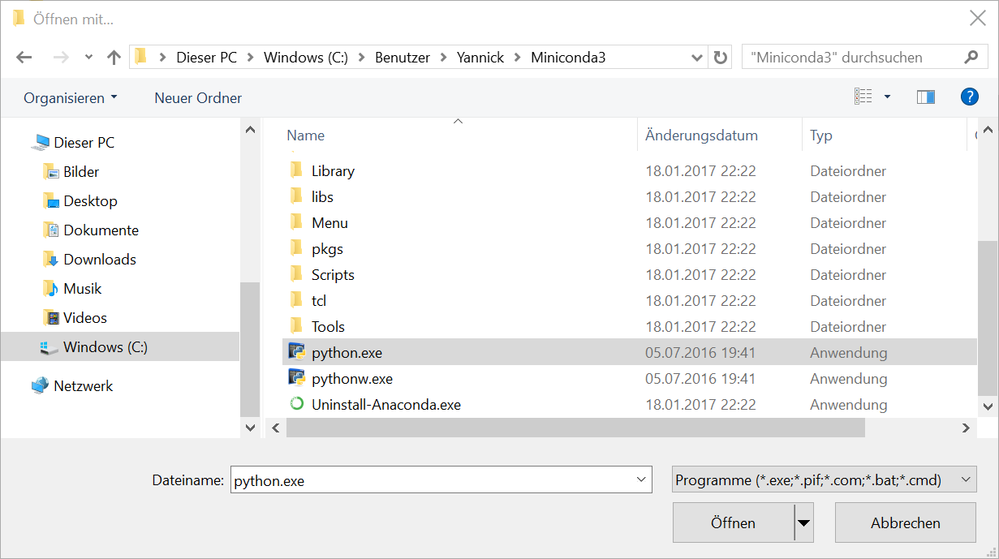

Python Installation und Ausführung
==================================
Neben Python 3.x wird *SciPy* und *NumPy* benötigt.

# Ausführung unter Linux

**Voraussetzung: Python 3.x mit pip**

Installation von *SciPy* und *NumPy*:
```
cd ./PubMedAuthorEvaluation
pip install -r requirements.txt
```

Ausführen der Scripts
```
python get_actors_publications.py
python calc_authors_results.py
```

# Ausführung unter Windows

Der Einfachheit halber verwenden wir **Miniconda**, welches Python als auch *conda*, einen Paketmanager, umfasst.

Bitte laden und installieren Sie die *Python 3.x* Version: http://conda.pydata.org/miniconda.html

Beim Installationsprozess kann der Ordner ausgewählt werden in den Miniconda installiert werden soll.
Standartmäßig wird es in den Benutzerordner installiert.

Nach erfolgreicher Installation müssen die benötigten Pakete heruntergeladen werden.

Öffnen Sie hierzu die Windows-Eingabeaufforderung.
* via Startmenü -> Suche nach *cmd.exe*
* **oder** in einem Ordner auf die weiße Fläche Rechtsklick und dabei "Shift/Großschreibtaste" gedrückt halten -> *Eingabeaufforderung hier öffnen*

Geben Sie folgendes Kommando ein:
* `conda update conda` [ENTER]

Bitte drücken Sie bei der Nachfrage (*Proceed ([y]/n)?*) die Enter-Taste um die Aktion zu bestätigen.

Gehen Sie mit folgenden Kommandos identisch vor:
* `conda install numpy` [ENTER]
* `conda install scipy` [ENTER]

## Ausführung testen

Navigieren Sie hierzu in den Ordner *PubMedAuthors* und machen einen Rechtsklick auf *get_actors_publications.py* oder *calc_authors_results.py*.

**Wählen Sie nun:**
Öffnen mit -> Andere App auswählen -> Weitere Apps -> Andere App auf diesen PC suchen (am Ende der Liste)
Nun müssen Sie die **python.exe** im Miniconda Ordner auswählen (Installationspfad!). Achtung, nicht pythonW.exe!



Bestätigen Sie die Auswahl. Der Script sollte nun in einem schwarzen Fenster starten.


## Verknüpfung mit Dateiendung
Nun müssen noch die Python-Dateien (.py als Dateiendung) mit dem Python Interpreter verknüpft werden, um die Dateien mit Doppelklick ausführen zu können.


Schließen Sie das Fenster und führen Sie erneut einen Rechtsklick auf eine der beiden Pythondateien aus.

Wählen Sie nun:
Öffnen mit -> Andere App auswählen -> Python auswählen (am Anfang der Liste)
Setzen Sie den Haken bei: **Immer diese App zum Öffnen von .py-Dateien verwenden**.
Bestätigen Sie mit OK.

Nun sollten Python-Dateien (.py) mit dem Python Interpreter verknüpft sein.
Klicken Sie doppelt auf die *get_actors_publications.py*-Datei.
Diese sollte nun ausgeführt werden und die nach einem Topic fragen.
Siehe hierzu die Readme.md
